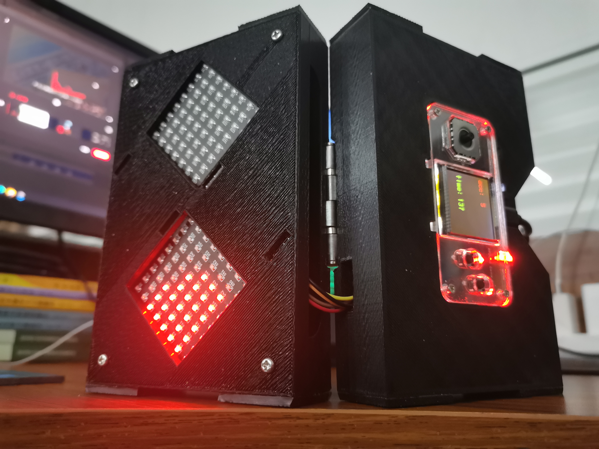
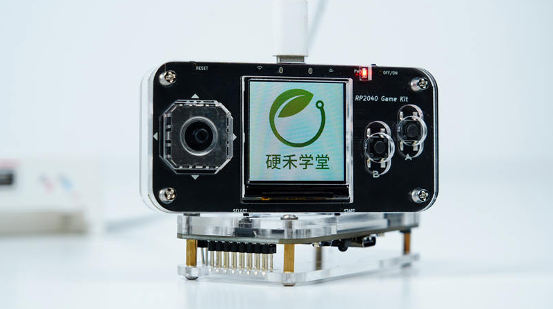
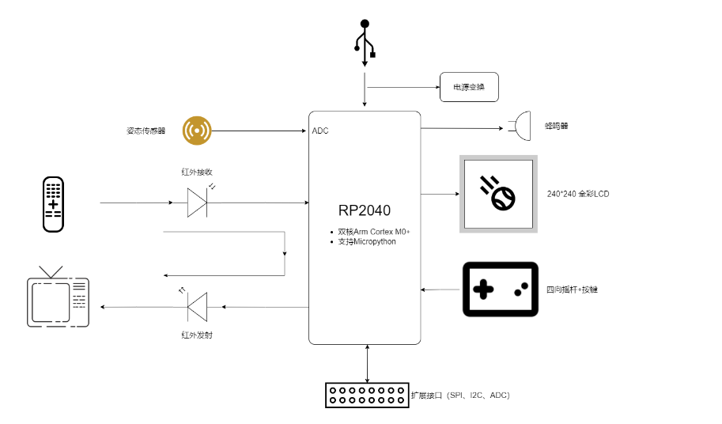
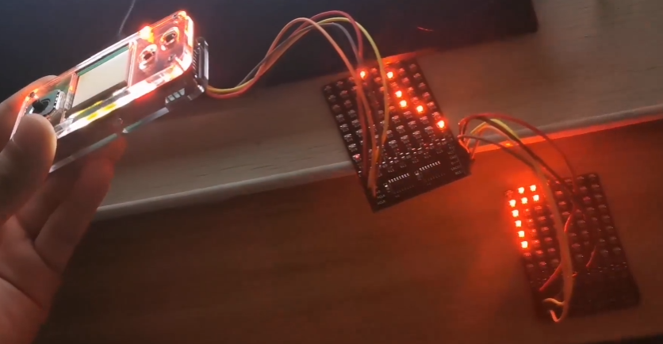
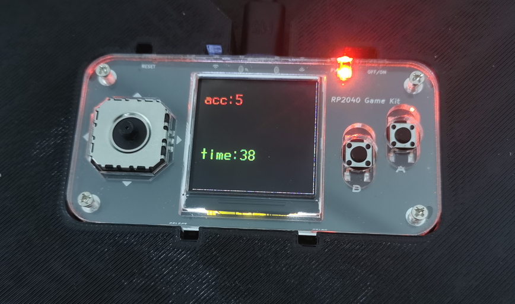
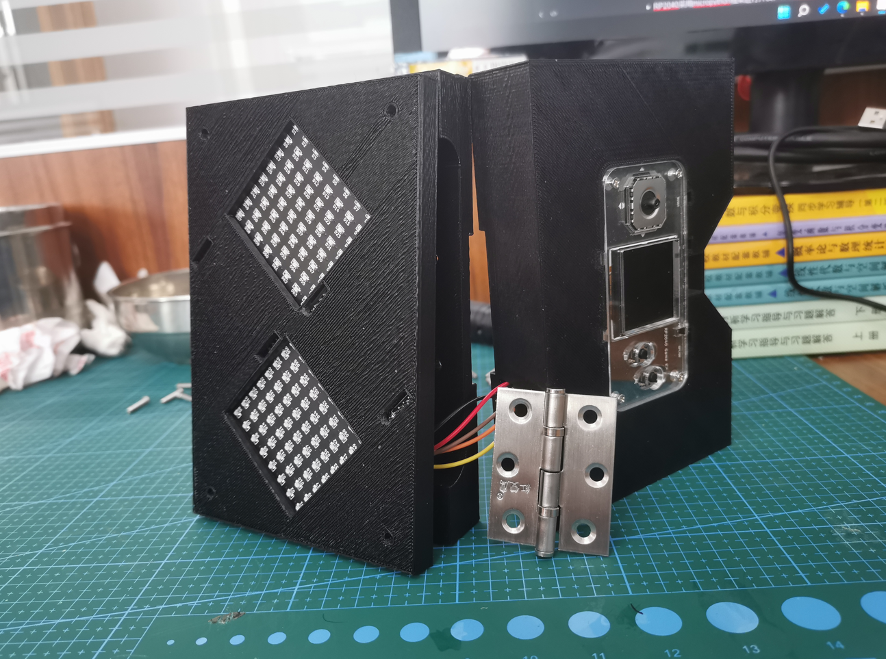
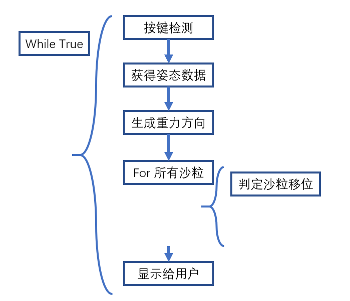
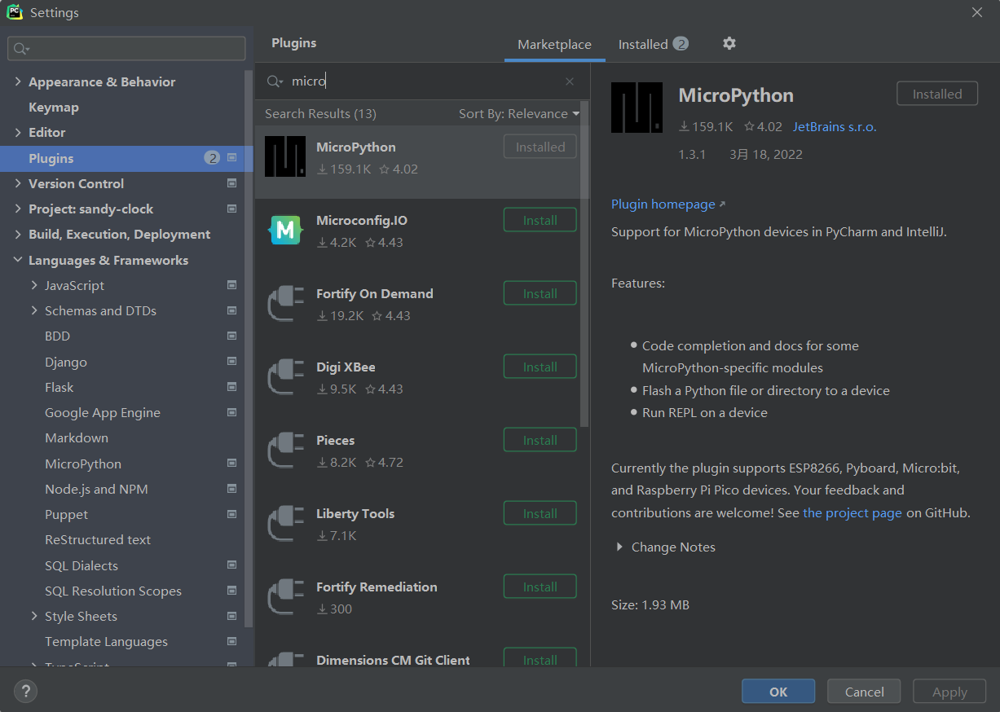
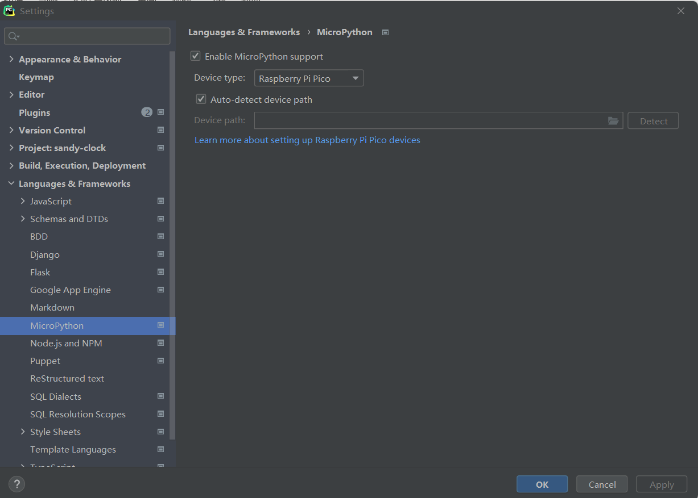

# 基于RP2040的电子沙漏




## 0 文件介绍

-   docs文件夹存放了项目使用到的一些模块的原理图；
-   sandy-clock文件夹存放了源代码，可直接使用pycharm打开，具体配置可见下文5.1节；
    -   sandy-clock文件夹中，main为主文件；
    -   main_pc为在电脑上运行的算法验证文件，与单片机硬件无关，可在python命令行中运行，每帧均可输入-180~180度的重力方向值，观察沙粒运动情况；
    -   其他文件均为main.py的库文件，均与硬件相关，在单片机上运行时需要一同上传上去。


## 1 项目需求

目标：实现一个可以定时调节速度的电子沙漏

具体要求:

1.  自行设计一个电子沙漏的物理结构，将提供的两个LED灯板和RP2040 Game Kit固定
2.  通过RP2040 Game Kit上的按键和LCD屏幕设定沙漏一个周期的时间，实现如上图中LED的效果
3.  通过RP2040 Game Kit上的姿态传感器来感知沙漏的方向变化，并开始新的沙漏操作

## 2 硬件介绍

项目使用的开发板为搭载RP2040芯片的游戏机开发板。

RP2040 Game Kit是基于树莓派RP2040的嵌入式系统学习平台，通过USB Type-C连接器供电，采用RP2040作为主控，具有双核Arm Cortex M0+内核和264KB内存，可通过MicroPython或C/C++编程，性能强大。板上四向摇杆 + 2个轻触按键 + 一个三轴姿态传感器MMA7660用做输入控制，并有240*240分辨率的彩色LCD屏显示，片内温度传感器、并支持外部4路模拟信号输入，内部ADC采样率高达500Ksps。可玩性极高，可移植多款复古游戏，还可作为电赛的控制、显示接口平台，搭配传感器、模拟电路外还可以完成更多创意项目。



硬件框图如下：



本项目使用了全彩LCD、按键与姿态传感器模块，并使用spi扩展接口控制LED灯板

## 3 完成的功能


3.1 电子沙漏中沙粒随重力方向下落



3.2 可调节电子沙漏计时时间



3.3 设计折叠屏机械结构，装配美观



## 4 实现思路

-   RP2040采用micropython框架进行开发，使用micropython的面向对象特性。
-   RP2040获取板载姿态传感器数据，推算出重力方向，并据此计算沙漏中沙粒的下落情况。
-   通过调节相邻沙粒在缝隙间穿梭的间隔帧数，调节时间，并在lcd屏幕上显示。
-   使用solidworks绘制折叠屏的3D模型，完成打印并组装。

## 5 实现过程

本项目的软件框架图如下：



### 5.1 环境配置

由于pycharm优秀的代码提示特性，且pycharm支持RP2040的micropython开发，项目初期使用pycharm开发沙粒受重力作用运动的算法。随后，使用Thonny将代码上载到RP2040开发板中。

使用pycharm开发micropython需要在Settings>>Plugins>>搜索安装micropython插件：



然后进入Settings>>Languages&Frameworks>>MicroPython 界面，将选项设置成下图的形式：



随后，pycharm即可识别出`import machine` 等 MicroPython 相关包，并正确进行`Pin()` 、`Timer()` 等模块的代码提示。

### 5.2  重力算法开发

代码方面，首先，定义Sandy类，表示每个沙粒，每个沙粒占据一个1*1的位置，其成员变量包括x，y轴坐标与一个标志位，这个标志位用来标志现在沙粒是在上面这个块还是下面这个块。其代码如下：

```python
class Sandy:

    def __init__(self, block, x, y):
        self.block = block  # 0->up,1->low
        self.x = x
        self.y = y
```


定义SandyClock类，该类为电子沙漏的顶层类，其成员变量报告：首先是两个8*8数组分别表示上下两个块每个像素的状态；一个沙粒的list，用于存放并索引到电子沙漏里存放的沙粒，还有一个三维向量用于标记重力方向。另外，为了实现调速等扩展功能，还需要添加时间相关变量。最后，SandyClock类构造函数如下：

```python
class SandyClock:
    # 板子是上面的还是下面的
    LOW_BLOCK = 0
    UP_BLOCK = 1

    # 这个位置是否有沙砾
    NO_SANDY = 0
    HAS_SANDY = 1

    # 是否在底边上
    IN_BOTTOM = 0
    NOT_IN_BOTTOM = 1
    IN_X_SLOPE = 2
    IN_Y_SLOPE = 3

    current_time = 0

    # 构造函数
    def __init__(self, sandy_list=None, size=None):
        # 棋盘大小，如果用的不是8*8矩阵，可以在这里改
        if size is None:
            size = [8, 8, 8, 8]
        self.up_block_x = size[0]
        self.up_block_y = size[1]
        self.low_block_x = size[2]
        self.low_block_y = size[3]

        # 沙砾集合
        if sandy_list is None:
            sandy_list = []
            for i in range(self.low_block_x):
                sandy_list.append(Sandy(SandyClock.LOW_BLOCK, 0, i))
            for i in range(self.low_block_x):
                sandy_list.append(Sandy(SandyClock.LOW_BLOCK, 2, i))
            for i in range(self.low_block_x):
                sandy_list.append(Sandy(SandyClock.LOW_BLOCK, 4, i))
            for i in range(self.low_block_x):
                sandy_list.append(Sandy(SandyClock.LOW_BLOCK, 6, i))

            # for i in range(self.up_block_x):
            #     sandy_list.append(Sandy(SandyClock.UP_BLOCK, 0, i))
        self.sandy_list = sandy_list

        # 生成棋盘
        self.up_block = [[SandyClock.NO_SANDY] * self.up_block_x for _ in range(self.up_block_y)]
        self.low_block = [[SandyClock.NO_SANDY] * self.low_block_x for _ in range(self.low_block_y)]

        # 把有沙子的地方赋值为1
        for index, sandy in enumerate(sandy_list):
            if sandy.block == SandyClock.LOW_BLOCK:
                self.low_block[sandy.x][sandy.y] = SandyClock.HAS_SANDY
            elif sandy.block == SandyClock.UP_BLOCK:
                self.up_block[sandy.x][sandy.y] = SandyClock.HAS_SANDY
            else:
                print("傻逼")

        # 重力方向
        self.gravity = [1, 1, 0]

        # 调速累加值
        self.keyframe_acc = 0
        self.keyframe_target = 5
        self.cross_crack_flag = False
```

每运行一轮，代码会有如下流程：

1.  检测用户按键，修改相应变量；
2.  获取重力的方向；
3.  对存放沙粒的list做随机排序
4.  对沙粒list中的沙粒逐个判定移位


代码如下：

```python
# 运行一轮
    def process(self):

        self.check_button()
        self.update_keyframe()

        # 获得重力
        self.gravity = self.update_gravity()
        # print(self.gravity, end="")

        # TODO:加上如果y与之前的y乘积是负数，说明翻过来了，清零


        # 根据沙砾的高度排序，算内积
        # 从下往上排序
        # self.sandy_list.sort(key=lambda sandy:( sandy.x * self.gravity[0] + sandy.y * self.gravity[1] ),reverse=True )
        # 从上往下排序
        # self.sandy_list.sort(key=lambda sandy:( sandy.x * self.gravity[0] + sandy.y * self.gravity[1] ))
        # 猴排，micropython用不了shuffle，只能自己写
        self.sandy_list.sort(key=lambda sandy: (random.random()))

        # 判断重力在哪个方向
        gravity_angle = cmath.phase(complex(self.gravity[0], self.gravity[1]))
        # print(gravity_angle)

        if -cmath.pi * 7 / 8 < gravity_angle <= -cmath.pi * 5 / 8:  # -x,-y
            for sandy in self.sandy_list:
                self.shift_sandy_bias(sandy, "-x-y")
                # print("-x-y")

        elif -cmath.pi * 5 / 8 < gravity_angle <= -cmath.pi * 3 / 8:  # -y
            for sandy in self.sandy_list:
                self.shift_sandy_straight(sandy, "-y")
                # print("-y")

        elif -cmath.pi * 3 / 8 < gravity_angle <= -cmath.pi / 8:  # +x,-y
            for sandy in self.sandy_list:
                self.shift_sandy_bias(sandy, "+x-y")
                # print("+x-y")

        elif -cmath.pi / 8 < gravity_angle <= cmath.pi / 8:  # +x
            for sandy in self.sandy_list:
                self.shift_sandy_straight(sandy, "+x")
                # print("+x")

        elif cmath.pi / 8 < gravity_angle <= cmath.pi * 3 / 8:  # +x,+y
            for sandy in self.sandy_list:
                self.shift_sandy_bias(sandy, "+x+y")
                # print("+x+y")

        elif cmath.pi * 3 / 8 < gravity_angle <= cmath.pi * 5 / 8:  # +y
            for sandy in self.sandy_list:
                self.shift_sandy_straight(sandy, "+y")
                # print("+y")

        elif cmath.pi * 5 / 8 < gravity_angle <= cmath.pi * 7 / 8:  # -x,+y
            for sandy in self.sandy_list:
                self.shift_sandy_bias(sandy, "-x+y")
                # print("-x+y")

        elif gravity_angle <= -cmath.pi * 7 / 8 or gravity_angle > cmath.pi * 7 / 8:  # -x
            for sandy in self.sandy_list:
                self.shift_sandy_straight(sandy, "-x")
                # print("-x")
```


其中，沙粒移位的代码逻辑为判断该沙粒下方的空间是否有别的沙粒或为底边，如果不是，则进行移位，如果是，则保持在原位。

正向移动的判断代码如下：

```python
    def shift_sandy_straight(self, sandy_para, gravity):
        global sandy
        sandy = sandy_para

        axis = "default"
        if "x" in gravity:
            axis = "x"
        elif "y" in gravity:
            axis = "y"
        else:
            print("傻逼")

        # 生成dx与dy
        dx = 0
        dy = 0
        if gravity == "+x":
            dx += 1
        elif gravity == "-x":
            dx -= 1
        elif gravity == "+y":
            dy += 1
        elif gravity == "-y":
            dy -= 1
        else:
            print("傻逼")

        # 判断是否在底边，生成flag
        bottom_flag = SandyClock.NOT_IN_BOTTOM
        if "+" in gravity:
            if eval("sandy." + axis) + 1 > 7:
                bottom_flag = SandyClock.IN_BOTTOM
        elif "-" in gravity:
            if eval("sandy." + axis) - 1 < 0:
                bottom_flag = SandyClock.IN_BOTTOM
        else:
            print("大傻逼")

        # # 判断是在上块还是在下块
        # block = "low_block"
        # if sandy.block == self.UP_BLOCK:
        #     block = "up_block"
        # elif sandy.block == self.LOW_BLOCK:
        #     block = "low_block"

        # 主判断流程
        # 如果在底边，判断是否可以移到下一个块中
        if bottom_flag == SandyClock.IN_BOTTOM:

            # 只有到了累加的关键帧，才能往下漏
            if self.cross_crack_flag == True:

                if sandy.block == SandyClock.LOW_BLOCK:
                    # 下到上，判断是否可以移动
                    if sandy.x == 7 and sandy.y == 7 \
                            and self.up_block[0][0] == SandyClock.NO_SANDY \
                            and (gravity == "+x" or gravity == "+y"):
                        # 移动
                        self.low_block[7][7] = SandyClock.NO_SANDY
                        self.up_block[0][0] = SandyClock.HAS_SANDY
                        # 更新sandy的坐标
                        sandy.block = SandyClock.UP_BLOCK
                        sandy.x = 0
                        sandy.y = 0

                elif sandy.block == SandyClock.UP_BLOCK:
                    # 上到下，判断是否可以移动
                    if sandy.x == 0 and sandy.y == 0 \
                            and self.low_block[7][7] == SandyClock.NO_SANDY \
                            and (gravity == "-x" or gravity == "-y"):
                        # 移动
                        self.up_block[0][0] = SandyClock.NO_SANDY
                        self.low_block[7][7] = SandyClock.HAS_SANDY
                        # 更新sandy的坐标
                        sandy.block = SandyClock.LOW_BLOCK
                        sandy.x = 7
                        sandy.y = 7

                else:
                    print("太傻逼了")

        # 如果不在底边，移位
        elif bottom_flag == SandyClock.NOT_IN_BOTTOM:
            # micropython不支持eval，只能轻微屎山不予处罚
            if sandy.block == self.UP_BLOCK:
                if self.up_block[sandy.x + dx][sandy.y + dy] == self.NO_SANDY:
                    # 说明下面是空的，进行移位
                    self.up_block[sandy.x][sandy.y] = self.NO_SANDY
                    self.up_block[sandy.x + dx][sandy.y + dy] = self.HAS_SANDY
                    # 更新sandy的坐标
                    sandy.x += dx
                    sandy.y += dy
            elif sandy.block == self.LOW_BLOCK:
                if self.low_block[sandy.x + dx][sandy.y + dy] == self.NO_SANDY:
                    # 说明下面是空的，进行移位
                    self.low_block[sandy.x][sandy.y] = self.NO_SANDY
                    self.low_block[sandy.x + dx][sandy.y + dy] = self.HAS_SANDY
                    # 更新sandy的坐标
                    sandy.x += dx
                    sandy.y += dy
        else:
            print("hello,大傻逼")
```


斜向移动的判断代码如下：

```python
    def shift_sandy_bias(self, sandy_para, gravity):
        global sandy
        sandy = sandy_para

        # 生成dx与dy
        dx = 0
        dy = 0
        if "+x" in gravity:
            dx += 1
        elif "-x" in gravity:
            dx -= 1
        else:
            print("傻逼")
        if "+y" in gravity:
            dy += 1
        elif "-y" in gravity:
            dy -= 1
        else:
            print("傻逼")

        # 判断是在上块还是在下块
        block = "low_block"
        if sandy.block == self.UP_BLOCK:
            block = "up_block"
        elif sandy.block == self.LOW_BLOCK:
            block = "low_block"

        # 判断是否在底边，生成flag
        x_slope_flag = SandyClock.NOT_IN_BOTTOM
        if "+x" in gravity:
            if eval("sandy.x") + 1 > 7:
                x_slope_flag = SandyClock.IN_X_SLOPE
        elif "-x" in gravity:
            if eval("sandy.x") - 1 < 0:
                x_slope_flag = SandyClock.IN_X_SLOPE
        else:
            print("大傻逼")

        y_slope_flag = SandyClock.NOT_IN_BOTTOM
        if "+y" in gravity:
            if eval("sandy.y") + 1 > 7:
                y_slope_flag = SandyClock.IN_Y_SLOPE
        elif "-y" in gravity:
            if eval("sandy.y") - 1 < 0:
                y_slope_flag = SandyClock.IN_Y_SLOPE
        else:
            print("大傻逼")

        bottom_flag = SandyClock.NOT_IN_BOTTOM
        if x_slope_flag == SandyClock.IN_X_SLOPE and y_slope_flag == SandyClock.IN_Y_SLOPE:
            bottom_flag = SandyClock.IN_BOTTOM
        elif x_slope_flag == SandyClock.IN_X_SLOPE:
            bottom_flag = SandyClock.IN_X_SLOPE
        elif y_slope_flag == SandyClock.IN_Y_SLOPE:
            bottom_flag = SandyClock.IN_Y_SLOPE

        # 主判断流程
        # 如果在斜底部，判断是否可以移到下一个块中
        if bottom_flag == SandyClock.IN_BOTTOM:
            # print("IN_BOTTOM")

            #只有到了那一帧，才能往下走
            if self.cross_crack_flag == True:
                if sandy.block == SandyClock.LOW_BLOCK:
                    # 下到上，判断是否可以移动
                    if sandy.x == 7 and sandy.y == 7 \
                            and self.up_block[0][0] == SandyClock.NO_SANDY \
                            and gravity == "+x+y":
                        # 移动
                        self.low_block[7][7] = SandyClock.NO_SANDY
                        self.up_block[0][0] = SandyClock.HAS_SANDY
                        # 更新sandy的坐标
                        sandy.block = SandyClock.UP_BLOCK
                        sandy.x = 0
                        sandy.y = 0

                elif sandy.block == SandyClock.UP_BLOCK:
                    # 上到下，判断是否可以移动
                    if sandy.x == 0 and sandy.y == 0 \
                            and self.low_block[7][7] == SandyClock.NO_SANDY \
                            and gravity == "-x-y":
                        # 移动
                        self.up_block[0][0] = SandyClock.NO_SANDY
                        self.low_block[7][7] = SandyClock.HAS_SANDY
                        # 更新sandy的坐标
                        sandy.block = SandyClock.LOW_BLOCK
                        sandy.x = 7
                        sandy.y = 7

                else:
                    print("太傻逼了")

        # 如果不在底边，必定无法到下面的块，再判断
        else:

            # 轻微屎山，up_block与low_block
            if sandy.block == self.UP_BLOCK:
                # 如果在X边，只有y的坐标会发生变化
                if bottom_flag == SandyClock.IN_X_SLOPE:
                    # 说明下面是空的，进行移位
                    if self.up_block[sandy.x][sandy.y + dy] == self.NO_SANDY:
                        self.up_block[sandy.x][sandy.y] = self.NO_SANDY
                        self.up_block[sandy.x][sandy.y + dy] = self.HAS_SANDY
                        # 更新sandy的坐标
                        sandy.y += dy
                # 如果在Y边，只有x的坐标会发生变化
                elif bottom_flag == SandyClock.IN_Y_SLOPE:
                    # 说明下面是空的，进行移位
                    if self.up_block[sandy.x + dx][sandy.y] == self.NO_SANDY:
                        self.up_block[sandy.x][sandy.y] = self.NO_SANDY
                        self.up_block[sandy.x + dx][sandy.y] = self.HAS_SANDY
                        # 更新sandy的坐标
                        sandy.x += dx
                # 如果不在底边上
                elif bottom_flag == SandyClock.NOT_IN_BOTTOM:
                    # 说明下面是空的，进行移位
                    if self.up_block[sandy.x + dx][sandy.y + dy] == self.NO_SANDY:
                        self.up_block[sandy.x][sandy.y] = self.NO_SANDY
                        self.up_block[sandy.x + dx][sandy.y + dy] = self.HAS_SANDY
                        # 更新sandy的坐标
                        sandy.x += dx
                        sandy.y += dy
                    # 下面不是空的就判断斜下面，现在这种写法不是左右随机下落，而是固定方向，先判断Y方向
                    # TODO:改为左右随机下落
                    elif self.up_block[sandy.x][sandy.y + dy] == self.NO_SANDY:
                        self.up_block[sandy.x][sandy.y] = self.NO_SANDY
                        self.up_block[sandy.x][sandy.y + dy] = self.HAS_SANDY
                        # 更新sandy的坐标
                        sandy.y += dy
                    # 再判断X方向
                    elif self.up_block[sandy.x + dx][sandy.y] == self.NO_SANDY:
                        self.up_block[sandy.x][sandy.y] = self.NO_SANDY
                        self.up_block[sandy.x + dx][sandy.y] = self.HAS_SANDY
                        # 更新sandy的坐标
                        sandy.x += dx
                    else:
                        # print("无法下落")
                        pass

            # 重复上面的，但是是下块，轻微屎山
            elif sandy.block == self.LOW_BLOCK:
                # 如果在X边，只有y的坐标会发生变化
                if bottom_flag == SandyClock.IN_X_SLOPE:
                    # 说明下面是空的，进行移位
                    if self.low_block[sandy.x][sandy.y + dy] == self.NO_SANDY:
                        self.low_block[sandy.x][sandy.y] = self.NO_SANDY
                        self.low_block[sandy.x][sandy.y + dy] = self.HAS_SANDY
                        # 更新sandy的坐标
                        sandy.y += dy
                # 如果在Y边，只有x的坐标会发生变化
                elif bottom_flag == SandyClock.IN_Y_SLOPE:
                    # 说明下面是空的，进行移位
                    if self.low_block[sandy.x + dx][sandy.y] == self.NO_SANDY:
                        self.low_block[sandy.x][sandy.y] = self.NO_SANDY
                        self.low_block[sandy.x + dx][sandy.y] = self.HAS_SANDY
                        # 更新sandy的坐标
                        sandy.x += dx
                # 如果不在底边上
                elif bottom_flag == SandyClock.NOT_IN_BOTTOM:
                    # 说明下面是空的，进行移位
                    if self.low_block[sandy.x + dx][sandy.y + dy] == self.NO_SANDY:
                        self.low_block[sandy.x][sandy.y] = self.NO_SANDY
                        self.low_block[sandy.x + dx][sandy.y + dy] = self.HAS_SANDY
                        # 更新sandy的坐标
                        sandy.x += dx
                        sandy.y += dy
                    # 下面不是空的就判断斜下面，现在这种写法不是左右随机下落，而是固定方向，先判断Y方向
                    # TODO:改为左右随机下落
                    elif self.low_block[sandy.x][sandy.y + dy] == self.NO_SANDY:
                        self.low_block[sandy.x][sandy.y] = self.NO_SANDY
                        self.low_block[sandy.x][sandy.y + dy] = self.HAS_SANDY
                        # 更新sandy的坐标
                        sandy.y += dy
                    # 再判断X方向
                    elif self.low_block[sandy.x + dx][sandy.y] == self.NO_SANDY:
                        self.low_block[sandy.x][sandy.y] = self.NO_SANDY
                        self.low_block[sandy.x + dx][sandy.y] = self.HAS_SANDY
                        # 更新sandy的坐标
                        sandy.x += dx
                    else:
                        pass
                        # print("无法下落")
```


### 5.3 添加底层驱动

底层驱动包括ST7789屏幕显示模块的驱动，MMA7660姿态传感器的驱动，与使用74HC595的LED灯板的驱动。由于均是从电子森林网站上直接复制的，所以在这里仅给出链接：

-   ST7789与MMA7660：[EETree-git/RP2040_Game_Kit (gitee.com)](https://gitee.com/eetree-git/RP2040_Game_Kit)
-   74HC595的LED灯板：[使用Micropython控制灯板 - 电子森林 (eetree.cn)](https://www.eetree.cn/project/detail/1095)

关于74HC595的一个参考视频：

-   [快速上手移位寄存器74HC595，并使用ATTiny13A的三个IO口驱动数码管【IC原来如此】_哔哩哔哩_bilibili](https://www.bilibili.com/video/BV1hb4y1m7k3?spm_id_from=333.337.search-card.all.click&vd_source=4ff5d8b280178b24895437b1b8ffd97e)


## 6 遇到的主要难题及解决方法

本项目遇到的困难不多，主要遇到了micropython对于某些python特性不支持的问题，比如，需要对list打乱排序的shuffle函数，micropython不支持，项目中改用了lambda表达式结合随机数达成了相同的效果。另外，python的eval()函数可以很方便得通过字符串对应到相应的变量名，但是micropython的eval仅支持全局变量。针对此现象，只能更改代码，将无法使用的部分使用if else代替。


## 7 收获与感想

本次项目属于是参加硬禾学堂活动以来做的最完整和硬核的一个项目了，从原理设计、代码编写、机械结构设计的流程全都走了一遍，也实现了预想的功能。以往的项目都停留在demo水平，这次算是做出了突破，实属不易。

本次项目我最大的突破就是是我第一个面向对象的嵌入式项目，一个偶然的机会，我翻阅了稚晖君电子小机器人的源码，其C++的面向对象特性直接击穿了我对嵌入式项目的认知。我一直想尝试一下，但使用C++或者用C模拟面向对象特性来开发stm32对我来说还是跨度太大，扯着蛋了。

最后，我还是拥抱了之前看不起的micropython。令我深感意外的是，开发micropython的体验竟然竟然如此的好。micropython可以让你直接免疫配环境和玄学问题，将主要精力集中在算法设计问题上，而且受pycharm的加持，智能提示的体验已经没有提升空间了。硬件可以使用搭载RP2040芯片的树莓派pico，当然还有本次使用的游戏机。资料方面呢可以很方便地在电子森林等平台找到。有一说一，对于想锻炼代码设计水平，尝试面向对象的兄弟们，非常推荐大家梭哈。
